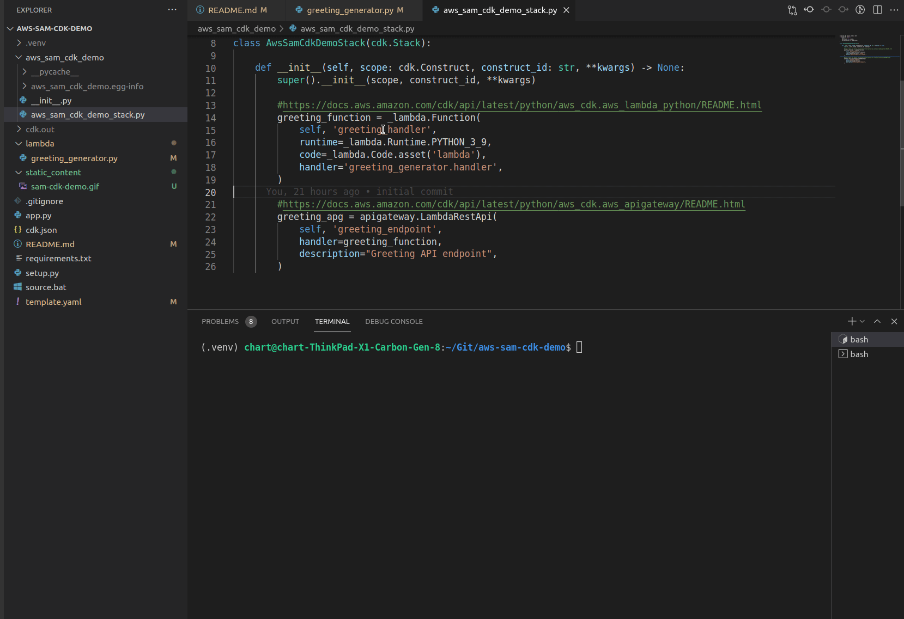

# Welcome to this example CDK project using sam to test Lambda locally!

This repo shows how to locally test a Lambda function created with AWS CDK using AWS SAM. 



## First setup your local environment

Ensure [AWS CDK](https://docs.aws.amazon.com/cdk/latest/guide/getting_started.html) and [AWS SAM](https://docs.aws.amazon.com/serverless-application-model/latest/developerguide/serverless-sam-cli-install.html) are installed. 

To manually create a virtualenv on MacOS and Linux:

```
$ python3 -m venv .venv
```

After the init process completes and the virtualenv is created, you can use the following
step to activate your virtualenv.

```
$ source .venv/bin/activate
```

If you are a Windows platform, you would activate the virtualenv like this:

```
% .venv\Scripts\activate.bat
```

Once the virtualenv is activated, you can install the required dependencies.

```
$ pip install -r requirements.txt
```

At this point you can now synthesize the CloudFormation template for this code.

```
$ cdk synth
```

## To test the provided code with SAM locally follow these steps

Activate your virtualenv.

```
$ source .venv/bin/activate
```

Synthesize a template and write it to template.yaml

```
$ cdk synth --no-staging > template.yaml
```

Test the API with SAM

```
$ sam local start-api
```

In your browser or in another terminal hit the endpoint http://127.0.0.1:3000/. 

You can change the code of your lambda function on the fly, no need to restart SAM. Simply edit the source code in the lambda/ dir and call the endpoint again. 


## Useful commands

 * `cdk ls`          list all stacks in the app
 * `cdk synth`       emits the synthesized CloudFormation template
 * `cdk deploy`      deploy this stack to your default AWS account/region
 * `cdk diff`        compare deployed stack with current state
 * `cdk docs`        open CDK documentation

Enjoy!
